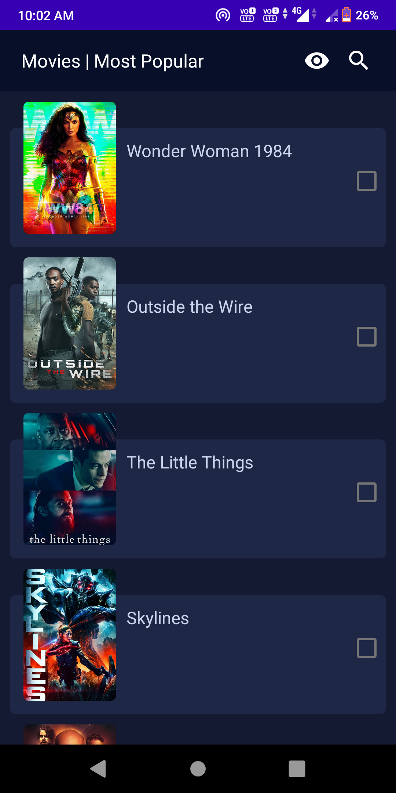
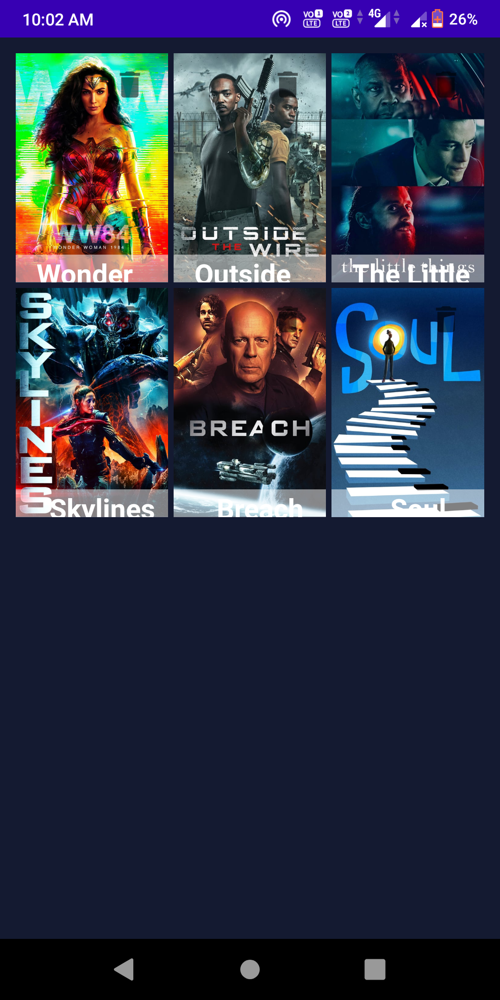

# MoviesDB-Application

MoviesDB  is an Android App which will provide you the latest movies and also with that you can make your watchlist to see any particular movies.This App follows the Mvvm Architecture Design Patterns for more readability of the code because of separation between the UI and the Business Logic.

# Screenshots

# Libraries this app uses
###### Retrofit Libraries - 
                            implementation 'com.squareup.retrofit2:retrofit:2.6.0'
                             implementation 'com.squareup.retrofit2:converter-gson:2.5.0'
                            implementation 'com.squareup.okhttp3:logging-interceptor:3.12.3'

###### Rounded Image View - 
                               implementation'com.makeramen:roundedimageview:2.3.0'
 ###### Glide -      
                    implementation 'com.github.bumptech.glide:glide:4.11.0'
                     annotationProcessor 'com.github.bumptech.glide:compiler:4.11.0'
  ###### ViewModel - 
                         implementation 'androidx.lifecycle:lifecycle-viewmodel-ktx:2.2.0'
   
   ###### Scalable Size Unit - 
                           implementation 'com.intuit.sdp:sdp-android:1.0.6'
                            implementation 'com.intuit.ssp:ssp-android:1.0.6'
         
         
   ###### Room Database   - 
                           implementation 'androidx.room:room-runtime:2.2.5'
                           annotationProcessor 'androidx.room:room-compiler:2.2.5'

# Permissions
###### Full Network Access

